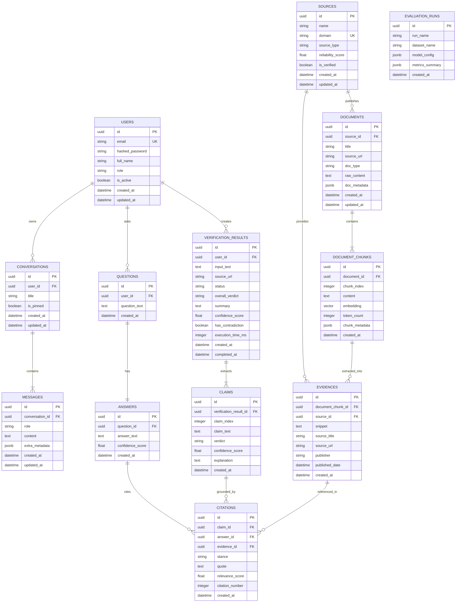

# Database Architecture & Entity Design: SourceCheck AI

Tài liệu thiết kế kiến trúc cơ sở dữ liệu chi tiết cho hệ thống **SourceCheck AI**. Tài liệu này định hình toàn bộ cấu trúc dữ liệu quan hệ, dữ liệu vector, mối quan hệ thực thể (ERD), chiến lược lưu trữ, đánh chỉ mục và phân định ranh giới giữa dữ liệu ứng dụng (Application Data) và dữ liệu thực nghiệm (Evaluation Data).

---

## 1. Triết lý Thiết kế & Nguyên tắc Cốt lõi

1. **Không tạo bảng thừa thãi ("YAGNI - You Aren't Gonna Need It")**: Mỗi thực thể được tạo ra phải có mục đích nghiệp vụ trực tiếp và rõ ràng trong đường ống: Tiếp nhận $\rightarrow$ Tìm kiếm $\rightarrow$ Đối soát $\rightarrow$ Trích dẫn.
2. **Độc lập với giao diện (UI Independence)**: Cấu trúc cơ sở dữ liệu phản ánh mô hình miền (Domain Model), không phụ thuộc vào trạng thái hiển thị của Frontend hay cấu trúc phân trang UI.
3. **Phân định ranh giới dữ liệu**:
   - **Application Relational Data**: Lưu trữ trên PostgreSQL (ACID, toàn vẹn quan hệ).
   - **Vector Data**: Lưu trữ nhúng vector ngay trong PostgreSQL thông qua phần mở rộng `pgvector`.
   - **Evaluation Datasets**: Các bộ dataset benchmark khổng lồ (FEVER, MultiFC, raw JSONL) được lưu trữ dưới dạng tệp trong thư mục `evaluation/datasets/`, **không ép vào database vận hành** trừ khi cần ghi nhận kết quả tổng hợp của từng lần chạy benchmark.

---

## 2. Phân tích Lựa chọn Công nghệ Vector: PostgreSQL + pgvector vs Qdrant

Để tối ưu hóa kiến trúc hệ thống cho quy mô dự án nghiên cứu / đồ án kỹ thuật, việc lựa chọn công cụ tìm kiếm vector được cân nhắc kỹ lưỡng:

### 2.1. Bảng so sánh chi tiết

| Tiêu chí | Phương án 1: PostgreSQL + pgvector (ĐƯỢC CHỌN) | Phương án 2: Cơ sở dữ liệu Vector riêng biệt (Qdrant) |
| :--- | :--- | :--- |
| **Độ phức tạp kiến trúc** | **Tối giản (Đơn CSDL)**: Toàn bộ dữ liệu quan hệ và vector nằm trong một dịch vụ duy nhất. | **Phức tạp (Đa CSDL)**: Phải duy trì, sao lưu và giám sát đồng thời 2 CSDL riêng biệt. |
| **Tính nhất quán dữ liệu (ACID)** | **Tuyệt đối**: Xóa một `Document` sẽ tự động xóa các chunks và vector liên kết trong cùng 1 transaction (`ON DELETE CASCADE`). | **Kém hơn**: Nguy cơ lỗi "Two-Phase Commit" (xóa thành công ở Postgres nhưng lỗi mạng ở Qdrant dẫn đến rác vector). |
| **Truy vấn lai (Hybrid Filtering)** | **Mạnh mẽ**: Kết hợp điều kiện lọc quan hệ và tìm kiếm vector trong cùng một câu lệnh SQL thuần (`WHERE source_id = ... ORDER BY embedding <=> ...`). | Phải thực hiện lọc qua Payload Filter của Qdrant hoặc truy vấn 2 lượt (truy vấn Postgres lấy IDs rồi lọc Qdrant). |
| **Tài nguyên phần cứng** | Tiết kiệm RAM, CPU; chỉ cần 1 Docker container (`pgvector/pgvector:pg16`). | Tốn thêm từ 1GB - 2GB RAM cho tiến trình Qdrant riêng biệt. |
| **Giải thuật Vector Index** | Hỗ trợ **HNSW** (Hierarchical Navigable Small World) và **IVFFlat**. Đạt tốc độ truy vấn mili-giây cho quy mô hàng trăm nghìn vector. | Hỗ trợ HNSW tối ưu cao bằng Rust, mạnh hơn khi dữ liệu đạt hàng chục triệu vector. |
| **Tích hợp LlamaIndex** | Hỗ trợ sẵn thông qua `PGVectorStore`. | Hỗ trợ sẵn thông qua `QdrantVectorStore`. |

### 2.2. Quyết định Kiến trúc (Architectural Decision)
- **Lựa chọn chính thức**: **PostgreSQL kết hợp `pgvector`**.
- **Lý do**: Phương án này giải quyết triệt để vấn đề đồng bộ dữ liệu, giảm thiểu sự cố vận hành, phù hợp hoàn hảo với quy mô đồ án và môi trường container cục bộ mà vẫn đảm bảo hiệu năng tìm kiếm tương đồng vector tiệm cận thời gian thực.
- **Khả năng mở rộng**: Tầng service trong code đã được bọc qua interface trừu tượng (`BaseVectorRetriever`), cho phép chuyển đổi sang Qdrant hoặc Milvus trong tương lai chỉ bằng cách thay thế adapter mà không ảnh hưởng tới logic nghiệp vụ.

---

## 3. Sơ đồ Quan hệ Thực thể (Entity-Relationship Diagram - ERD)

### 3.1. Sơ đồ Mermaid ERD



---

## 4. Chi tiết Định nghĩa Thực thể & Ràng buộc (Entity Specifications)

### 4.1. `users` (Người dùng hệ thống)
- **Mục đích**: Định danh người dùng phục vụ phân quyền và lưu vết lịch sử cá nhân.
- **Cột**:
  - `id`: `UUID`, Khóa chính (Primary Key), sinh mặc định `gen_random_uuid()`.
  - `email`: `VARCHAR(255)`, Bắt buộc, Không trùng lặp (Unique Index).
  - `hashed_password`: `VARCHAR(255)`, Bắt buộc (sử dụng bcrypt).
  - `full_name`: `VARCHAR(255)`, Bắt buộc.
  - `role`: `VARCHAR(50)`, Bắt buộc, Mặc định `'user'` (`'user'`, `'researcher'`, `'admin'`).
  - `is_active`: `BOOLEAN`, Bắt buộc, Mặc định `TRUE`.
  - `created_at`, `updated_at`: `TIMESTAMP WITH TIME ZONE`.

### 4.2. `sources` (Nguồn thông tin & Đơn vị xuất bản)
- **Mục đích**: Quản trị độ tin cậy và danh tính của các cơ quan báo chí, tổ chức chính phủ hoặc trang web.
- **Cột**:
  - `id`: `UUID`, Khóa chính.
  - `name`: `VARCHAR(255)`, Bắt buộc (Ví dụ: "Tuổi Trẻ Online", "Tổng cục Thống kê").
  - `domain`: `VARCHAR(255)`, Bắt buộc, Không trùng lặp (Ví dụ: "tuoitre.vn", "gso.gov.vn").
  - `source_type`: `VARCHAR(50)`, Mặc định `'news'` (`'news'`, `'government'`, `'academic'`, `'fact_checker'`).
  - `reliability_score`: `FLOAT`, Mặc định `1.0` (Điểm uy tín từ 0.0 đến 1.0).
  - `is_verified`: `BOOLEAN`, Mặc định `FALSE` (Được kiểm định là nguồn uy tín).
  - `created_at`, `updated_at`: `TIMESTAMP WITH TIME ZONE`.

### 4.3. `documents` (Tài liệu gốc nạp vào kho tri thức)
- **Mục đích**: Lưu trữ bài viết, báo cáo tài liệu đầy đủ trước khi phân đoạn.
- **Cột**:
  - `id`: `UUID`, Khóa chính.
  - `source_id`: `UUID`, Khóa ngoại trỏ tới `sources.id`, Cho phép `NULL` (nếu văn bản do người dùng nạp không rõ nguồn), `ON DELETE SET NULL`.
  - `title`: `VARCHAR(500)`, Bắt buộc.
  - `source_url`: `VARCHAR(2048)`, Tùy chọn (URL bài viết).
  - `doc_type`: `VARCHAR(50)`, Bắt buộc, Mặc định `'text'` (`'text'`, `'pdf'`, `'url'`, `'markdown'`).
  - `raw_content`: `TEXT`, Bắt buộc (Nội dung văn bản thuần hoàn chỉnh).
  - `doc_metadata`: `JSONB`, Tùy chọn (Tác giả, ngày xuất bản gốc, số trang, tags).
  - `created_at`, `updated_at`: `TIMESTAMP WITH TIME ZONE`.

### 4.4. `document_chunks` (Phân đoạn tài liệu & Vector Embeddings)
- **Mục đích**: Đơn vị cơ sở phục vụ tìm kiếm ngữ nghĩa và BM25.
- **Cột**:
  - `id`: `UUID`, Khóa chính.
  - `document_id`: `UUID`, Khóa ngoại trỏ tới `documents.id`, Bắt buộc, `ON DELETE CASCADE`.
  - `chunk_index`: `INTEGER`, Bắt buộc (Thứ tự đoạn trích: 0, 1, 2...).
  - `content`: `TEXT`, Bắt buộc (Nội dung đoạn văn).
  - `embedding`: `VECTOR(1536)`, Vector nhúng đa chiều từ embedding model (`text-embedding-3-small` hoặc `bge-m3`).
  - `token_count`: `INTEGER`, Số lượng token trong chunk.
  - `chunk_metadata`: `JSONB`, Tùy chọn (Vị trí ký tự bắt đầu/kết thúc, ngữ cảnh xung quanh).
  - `created_at`: `TIMESTAMP WITH TIME ZONE`.

### 4.5. `questions` & `answers` (Tính năng Hỏi - Đáp Grounded Q&A)
- **`questions`**:
  - `id`: `UUID`, Khóa chính.
  - `user_id`: `UUID`, Khóa ngoại trỏ tới `users.id`, Cho phép `NULL` (khách), `ON DELETE SET NULL`.
  - `question_text`: `TEXT`, Bắt buộc.
  - `created_at`: `TIMESTAMP WITH TIME ZONE`.
- **`answers`**:
  - `id`: `UUID`, Khóa chính.
  - `question_id`: `UUID`, Khóa ngoại trỏ tới `questions.id`, Không trùng lặp (Quan hệ 1:1), Bắt buộc, `ON DELETE CASCADE`.
  - `answer_text`: `TEXT`, Bắt buộc.
  - `confidence_score`: `FLOAT`, Mặc định `0.0`.
  - `created_at`: `TIMESTAMP WITH TIME ZONE`.

### 4.6. `verification_results` (Phiên làm việc & Báo cáo Fact-Check)
- **Mục đích**: Đại diện cho một phiên thẩm định hoàn chỉnh do người dùng yêu cầu.
- **Cột**:
  - `id`: `UUID`, Khóa chính.
  - `user_id`: `UUID`, Khóa ngoại trỏ tới `users.id`, Cho phép `NULL` (khách), `ON DELETE SET NULL`.
  - `input_text`: `TEXT`, Bắt buộc (Đoạn văn, tin nhắn cần kiểm tra).
  - `source_url`: `VARCHAR(2048)`, Tùy chọn.
  - `status`: `VARCHAR(50)`, Bắt buộc, Mặc định `'PENDING'` (`'PENDING'`, `'PROCESSING'`, `'COMPLETED'`, `'FAILED'`).
  - `overall_verdict`: `VARCHAR(50)`, Bắt buộc, Mặc định `'UNVERIFIED'` (`'TRUE'`, `'FALSE'`, `'MIXED'`, `'UNVERIFIED'`).
  - `summary`: `TEXT`, Tóm tắt lập luận tổng hợp.
  - `confidence_score`: `FLOAT`, Mặc định `0.0`.
  - `has_contradiction`: `BOOLEAN`, Mặc định `FALSE` (Báo hiệu nếu phát hiện mâu thuẫn).
  - `execution_time_ms`: `INTEGER`, Thời gian xử lý đường ống tính bằng mili-giây.
  - `created_at`, `completed_at`: `TIMESTAMP WITH TIME ZONE`.

### 4.7. `claims` (Nhận định bóc tách)
- **Mục đích**: Lưu trữ từng khẳng định sự thật độc lập được phân tách từ `input_text`.
- **Cột**:
  - `id`: `UUID`, Khóa chính.
  - `verification_result_id`: `UUID`, Khóa ngoại trỏ tới `verification_results.id`, Bắt buộc, `ON DELETE CASCADE`.
  - `claim_index`: `INTEGER`, Bắt buộc (Vị trí xuất hiện của nhận định: 1, 2, 3...).
  - `claim_text`: `TEXT`, Bắt buộc (Nội dung câu khẳng định đã chuẩn hóa).
  - `verdict`: `VARCHAR(50)`, Bắt buộc, Mặc định `'NOT_ENOUGH_INFO'` (`'SUPPORTED'`, `'REFUTED'`, `'PARTIALLY_SUPPORTED'`, `'NOT_ENOUGH_INFO'`).
  - `confidence_score`: `FLOAT`, Mặc định `0.0`.
  - `explanation`: `TEXT`, Lập luận vì sao gán nhãn phán quyết đó.
  - `created_at`: `TIMESTAMP WITH TIME ZONE`.

### 4.8. `evidences` (Bằng chứng đối soát)
- **Mục đích**: Đoạn trích dẫn độc lập được hệ thống tìm thấy và dùng làm căn cứ.
- **Cột**:
  - `id`: `UUID`, Khóa chính.
  - `document_chunk_id`: `UUID`, Khóa ngoại trỏ tới `document_chunks.id`, Cho phép `NULL` (nếu là bằng chứng real-time từ API bên ngoài), `ON DELETE SET NULL`.
  - `source_id`: `UUID`, Khóa ngoại trỏ tới `sources.id`, Cho phép `NULL`, `ON DELETE SET NULL`.
  - `snippet`: `TEXT`, Bắt buộc (Nội dung đoạn văn bằng chứng).
  - `source_title`: `VARCHAR(500)`, Bắt buộc.
  - `source_url`: `VARCHAR(2048)`, Tùy chọn.
  - `publisher`: `VARCHAR(255)`, Tùy chọn.
  - `published_date`: `TIMESTAMP WITH TIME ZONE`, Tùy chọn.
  - `created_at`: `TIMESTAMP WITH TIME ZONE`.

### 4.9. `citations` (Thực thể Trích dẫn Liên kết)
- **Mục đích**: **Thực thể trung tâm kết nối** giữa bằng chứng (`Evidence`) với kết quả suy luận (`Claim` hoặc `Answer`).
- **Cột**:
  - `id`: `UUID`, Khóa chính.
  - `claim_id`: `UUID`, Khóa ngoại trỏ tới `claims.id`, Cho phép `NULL`, `ON DELETE CASCADE`.
  - `answer_id`: `UUID`, Khóa ngoại trỏ tới `answers.id`, Cho phép `NULL`, `ON DELETE CASCADE`.
  - `evidence_id`: `UUID`, Khóa ngoại trỏ tới `evidences.id`, Bắt buộc, `ON DELETE CASCADE`.
  - `stance`: `VARCHAR(50)`, Mặc định `'NEUTRAL'` (`'SUPPORTS'`, `'REFUTES'`, `'NEUTRAL'`).
  - `quote`: `TEXT`, Trích đoạn nguyên văn làm cơ sở đối chiếu (chìa khóa loại bỏ ảo giác).
  - `relevance_score`: `FLOAT`, Điểm tương quan sau reranking ($0.0 - 1.0$).
  - `citation_number`: `INTEGER`, Chỉ số chú thích đánh số (`[1]`, `[2]`, `[3]`).
  - `created_at`: `TIMESTAMP WITH TIME ZONE`.
- **Ràng buộc kiểm tra (Check Constraint)**:
  `CHECK (claim_id IS NOT NULL OR answer_id IS NOT NULL)`

### 4.10. `conversations` (Phiên Hội thoại & Lịch sử Tra cứu - CHAT-02.1)
- **Mục đích**: Lưu trữ thông tin từng phiên hội thoại/tra cứu của người dùng trong Research Chat Workspace.
- **Cột**:
  - `id`: `UUID`, Khóa chính.
  - `user_id`: `UUID`, Khóa ngoại trỏ tới `users.id`, Bắt buộc, `ON DELETE CASCADE`.
  - `title`: `VARCHAR(255)`, Bắt buộc, Mặc định `'Cuộc trò chuyện mới'`.
  - `is_pinned`: `BOOLEAN`, Bắt buộc, Mặc định `FALSE`.
  - `created_at`, `updated_at`: `TIMESTAMP WITH TIME ZONE`.
- **Chỉ mục (Indexes)**:
  - `idx_conversations_user_id`: Tối ưu hóa lọc danh sách hội thoại theo tài khoản.
  - `idx_conversations_user_created`: Tối ưu hóa sắp xếp lịch sử theo thời gian tạo mới nhất.

### 4.11. `messages` (Tin nhắn & Trạng thái Đa lượt - CHAT-02.1)
- **Mục đích**: Lưu trữ chi tiết từng lượt hỏi của người dùng và câu trả lời kèm siêu dữ liệu bảo chứng của AI.
- **Cột**:
  - `id`: `UUID`, Khóa chính.
  - `conversation_id`: `UUID`, Khóa ngoại trỏ tới `conversations.id`, Bắt buộc, `ON DELETE CASCADE`.
  - `role`: `VARCHAR(32)`, Bắt buộc (`'user'`, `'assistant'`).
  - `content`: `TEXT`, Bắt buộc (Nội dung tin nhắn).
  - `extra_metadata`: `JSONB`, Tùy chọn (Lưu trữ citations, claims breakdown, evidence coverage, verification verdict).
  - `created_at`, `updated_at`: `TIMESTAMP WITH TIME ZONE`.
- **Chỉ mục (Indexes)**:
  - `idx_messages_conversation_id`: Tối ưu hóa tải toàn bộ tin nhắn thuộc một cuộc trò chuyện.
  - `idx_messages_conversation_created`: Sắp xếp các lượt hội thoại theo trình tự thời gian tuần tự.

### 4.12. `evaluation_runs` (Dữ liệu Đánh giá Benchmark Tối giản)
- **Mục đích**: Chỉ lưu siêu dữ liệu (metadata) và tóm tắt kết quả của các lần chạy benchmark, **không lưu hàng triệu bản ghi dataset mẫu**.
- **Cột**:
  - `id`: `UUID`, Khóa chính.
  - `run_name`: `VARCHAR(255)`, Tên đợt thử nghiệm (Ví dụ: "Ablation_Reranker_Off_v1").
  - `dataset_name`: `VARCHAR(100)`, Tên tập dữ liệu (Ví dụ: "FEVER_Vi_500").
  - `model_config`: `JSONB`, Cấu hình tham số (Top-K, RRF weights, LLM model).
  - `metrics_summary`: `JSONB`, Kết quả định lượng tổng hợp (`{"precision": 0.88, "recall": 0.84, "f1": 0.86, "faithfulness": 0.92}`).
  - `created_at`: `TIMESTAMP WITH TIME ZONE`.

---

## 5. Luồng Dữ liệu Cơ sở Dữ liệu (Database Data Flow)

### 5.1. Luồng Nạp & Chỉ mục Tài liệu (Ingestion Flow)
```text
Raw Text/URL ──► INSERT INTO documents
                       │
                       ▼ (Tách chunks & nhúng vector)
                 INSERT INTO document_chunks (content, embedding)
```

### 5.2. Luồng Kiểm chứng (Verification Flow)
```text
User Text ────► INSERT INTO verification_results (status = 'PROCESSING')
                       │
                       ▼ (Bóc tách claims)
                 INSERT INTO claims (claim_text, verdict = 'PENDING')
                       │
                       ▼ (Tìm kiếm vector & BM25)
                 SELECT chunks FROM document_chunks 
                 ORDER BY embedding <=> query_embedding LIMIT 10
                       │
                       ▼ (Ghi nhận bằng chứng đã lọc)
                 INSERT INTO evidences (snippet, source_url)
                       │
                       ▼ (Gắn lập trường & quote)
                 INSERT INTO citations (claim_id, evidence_id, stance, quote)
                       │
                       ▼ (Cập nhật kết quả cuối)
                 UPDATE claims SET verdict = '...', explanation = '...'
                 UPDATE verification_results SET status = 'COMPLETED', overall_verdict = '...'
```

---

## 6. Chiến lược Đánh Chỉ mục & Tối ưu hóa (Indexing Strategy)

Để đảm bảo thời gian phản hồi dưới 1 giây cho các tác vụ tra cứu, chiến lược index được triển khai trên 3 phương diện:

### 6.1. Chỉ mục Vector (Vector Similarity Index)
Sử dụng thuật toán đồ thị HNSW trong `pgvector` trên cột `embedding`:
```sql
CREATE INDEX idx_document_chunks_embedding_hnsw 
ON document_chunks 
USING hnsw (embedding vector_cosine_ops)
WITH (m = 16, ef_construction = 100);
```
- `vector_cosine_ops`: Tối ưu cho khoảng cách Cosine $\in [0, 2]$.
- `m = 16`: Số lượng liên kết tối đa trên mỗi nút đồ thị.
- `ef_construction = 100`: Độ sâu tìm kiếm trong lúc xây dựng đồ thị, mang lại tỷ lệ Recall cao khi truy xuất.

### 6.2. Chỉ mục Quan hệ & Khóa ngoại (B-Tree Indexes)
Đảm bảo các thao tác JOIN và WHERE chạy tức thời:
- `CREATE INDEX idx_documents_source_id ON documents(source_id);`
- `CREATE INDEX idx_document_chunks_doc_id ON document_chunks(document_id);`
- `CREATE INDEX idx_claims_verification_result_id ON claims(verification_result_id);`
- `CREATE INDEX idx_citations_claim_id ON citations(claim_id);`
- `CREATE INDEX idx_citations_evidence_id ON citations(evidence_id);`
- `CREATE INDEX idx_verification_results_user_date ON verification_results(user_id, created_at DESC);`

### 6.3. Chỉ mục Tìm kiếm Toàn văn & Metadata (GIN Indexes)
- Hỗ trợ tìm kiếm từ khóa cục bộ và truy vấn linh hoạt trên các trường JSONB:
```sql
-- GIN index cho metadata của tài liệu
CREATE INDEX idx_documents_metadata_gin ON documents USING gin (doc_metadata);

-- GIN index hỗ trợ Full-Text Search tiếng Anh/Việt trên nội dung chunk
CREATE INDEX idx_document_chunks_content_fts ON document_chunks USING gin (to_tsvector('simple', content));
```

---

## 7. Đảm bảo Tính toàn vẹn & Ranh giới Nghiệp vụ

1. **Ràng buộc Xóa theo chuỗi (Cascading Deletes)**:
   - Xóa `Document` $\rightarrow$ Xóa toàn bộ `DocumentChunk` liên quan $\rightarrow$ Chuyển khóa ngoại `document_chunk_id` trong `Evidence` thành `NULL` (đảm bảo không mất vết bằng chứng lịch sử).
   - Xóa `VerificationResult` $\rightarrow$ Xóa toàn bộ `Claim` và các `Citation` liên quan.
2. **Không trộn lẫn Evaluation Raw Data**:
   - Dữ liệu ground-truth thô để benchmark nằm tại filesystem `evaluation/datasets/`.
   - Bảng `evaluation_runs` trong CSDL chỉ ghi nhận lịch sử thử nghiệm và bảng điểm tổng kết (Summary Report), tuyệt đối không phình to database vận hành.

---

## 8. Quản trị Migration với Alembic (Database Migrations)

Để kiểm soát phiên bản cấu trúc CSDL và phục vụ triển khai CI/CD, hệ thống sử dụng **Alembic** làm công cụ migration chính thức (thay vì dùng `Base.metadata.create_all()`):

- **Vị trí cấu hình**: [`backend/alembic.ini`](file:///c:/Users/MY%20PC/Documents/AI/SourceCheck%20AI/backend/alembic.ini) và [`backend/alembic/`](file:///c:/Users/MY%20PC/Documents/AI/SourceCheck%20AI/backend/alembic).
- **Migration đầu tiên**: `001_initial_schema.py`
  - Tự động kích hoạt extension `vector` trong PostgreSQL (`CREATE EXTENSION IF NOT EXISTS vector;`).
  - Khởi tạo toàn bộ 11 bảng, khóa ngoại, ràng buộc check và các index quan trọng (HNSW cho vector, B-Tree cho quan hệ, Unique cho email/domain).
- **Lệnh thực thi chuẩn**:
  - Nâng cấp lên schema mới nhất: `python -m alembic upgrade head`
  - Hoàn tác migration gần nhất: `python -m alembic downgrade -1`
  - Xuất file SQL offline (không cần kết nối trực tiếp DB): `python -m alembic upgrade head --sql`
